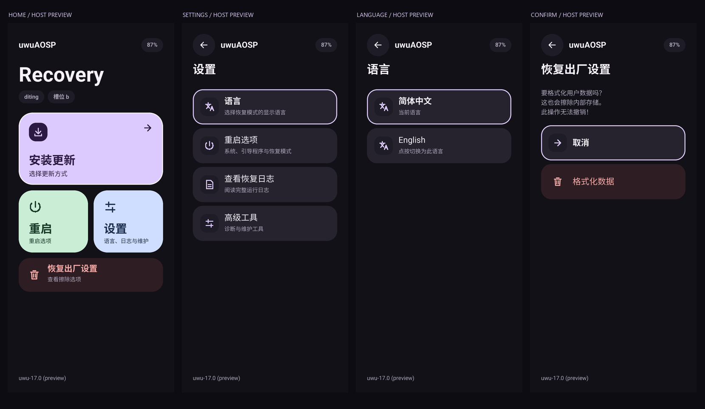
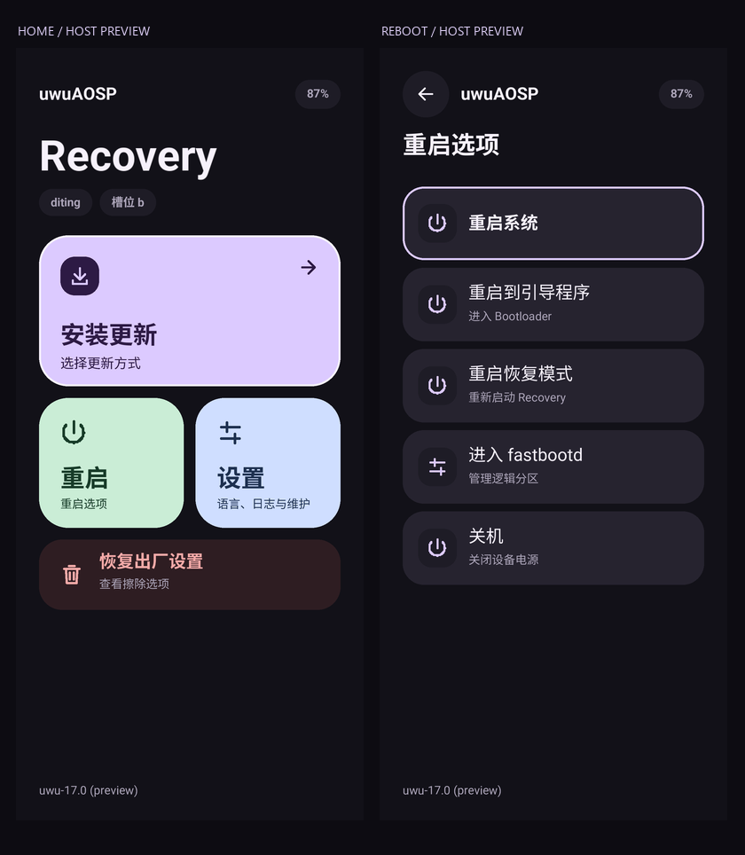
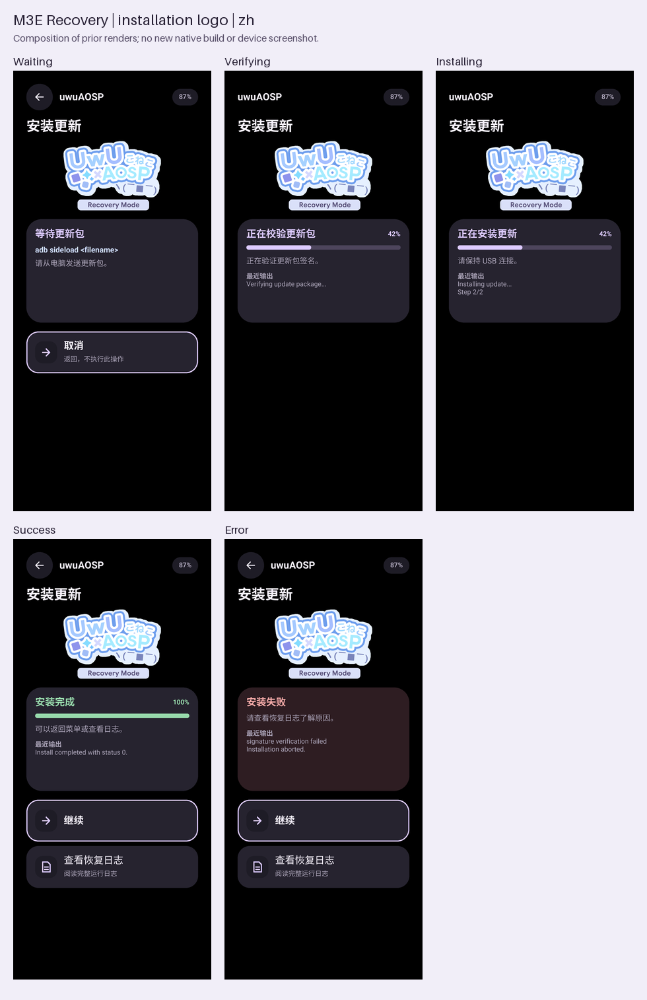
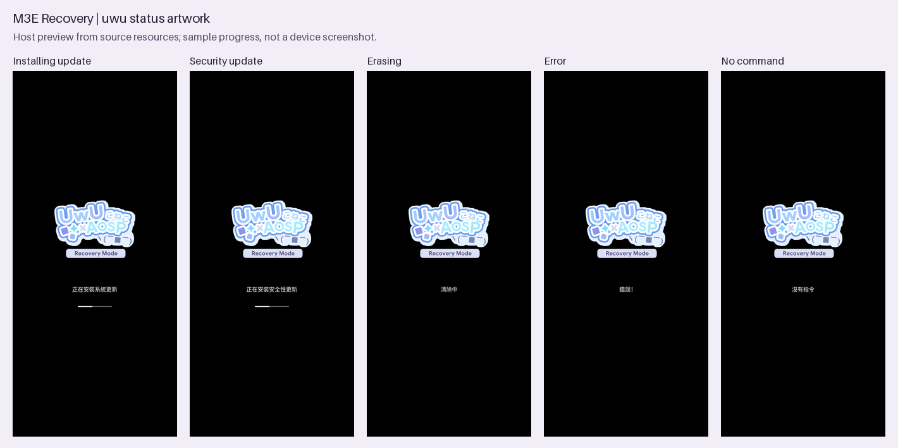

# M3E：Material 3 Expressive 原生 Recovery 界面

本分支 `uwu-17.0-m3e` 在 uwuAOSP `bootable/recovery`（分支 `uwu-17.0`，基线提交
`74fa68b89b1cf5958859f2433fc197e809d48c84`）之上加入 M3E v4 界面。

M3E 是一套 Material 3 Expressive 风格的 Recovery 界面，直接在原有 C++ / minui 绘制路径中实现：
卡片式菜单、比例字体（Roboto / Noto Sans SC 灰度字形）、独立页脚，以及简体中文 / English 切换。
不依赖 Java、Compose 或设备端字体库；字形数据预先生成为头文件编译进 `librecovery_ui`。
界面与具体机型无关，适用于任何使用本仓库作为 `bootable/recovery` 的设备。




预览图由主机上的 C++ 绘制器生成，电量、版本、槽位等为样例数据。

## 菜单结构

- 首页：安装更新、重启、设置、恢复出厂设置。
- 重启（首页进入）：先选目标——系统、Recovery、Bootloader，另保留 fastbootd 和关机。
- 设置：语言、重启选项、查看恢复日志、高级工具。
- 语言：简体中文、English；标出当前语言，点按立即生效。
- 高级工具：挂载/卸载系统、启用 ADB、图形测试、语言资源测试、救援模式。

返回键逐级返回（从首页打开的重启菜单返回首页，从设置打开则返回设置）。
OTA 安装、签名校验、擦除确认等逻辑沿用上游实现。

可选存储解密框架和设备树后端接口见 [crypto/README.md](crypto/README.md)。
当前没有随仓库提供可用的 Android 17 设备解密后端，未适配设备不显示内部存储解密入口。

## 图形化安装流程

交互式 ADB sideload 使用实际安装后端驱动的 M3E 页面：等待更新包 → 签名校验 → 安装 → 结果。
等待时提供 `adb sideload <filename>` 提示和取消按钮；写入期间不显示取消按钮。
退出安装菜单或取消等待更新包后直接返回菜单，不显示“安装未开始”结果页。
成功和失败分别使用绿色和红色状态，结果页可继续返回菜单或查看完整恢复日志。
安装页面支持简体中文 / English；日志原文保留。

安装页顶部使用 `uwuAOSP` 文字，和返回键、电量处于同一栏。
安装标题下方居中显示 uwuAOSP Recovery logo，然后显示状态卡片。
等待、验证、安装、成功和失败页面共用同一图片资源，不改变安装逻辑。



此预览复用此前带 logo 的原生渲染画面，移除已经取消的“安装未开始”页面后合成；本次未执行 C++ 或 Android 编译。
下方原生检查工具已同步新布局，重编译后的实际显示仍由构建与设备验证。

这条渲染路径在交互式 `show_text=true` 时也生效，解决原先等待菜单关闭后回退到文本控制台的问题。
进度沿用后端 `progressScopeStart + progress * progressScopeSize`，不是单独的 ADB 传输百分比；
后端尚未提供确定进度时只显示短进度标记，不编造百分比。最近输出只作摘要，原始日志仍完整写入。
签名不匹配、降级等确认菜单优先于进度页面显示。

菜单安装和 `adb reboot sideload` 均可显示结果；`sideload-auto-reboot` 保持上游自动重启语义。
文件安装复用同一校验/安装页面，能否读取内部存储和支持何种 ZIP 仍由现有挂载、解密及安装后端决定。
小屏及横屏空间不足时使用紧凑文字页头，优先保证状态文案和按钮可见。
图片缺失或剩余空间不足时直接显示状态卡片，不保留空白图片占位，也不压缩状态卡片或遮挡按钮。

页面由 `recovery_ui/include/recovery_ui/m3e_install.h` 绘制，阶段接口在 `install_status.h`；
`install/adb_install.cpp`、`install/install.cpp` 和 `recovery.cpp` 负责更新阶段与展示结果。

主机检查与预览（Python 3、Pillow、C++17 编译器）：

```bash
python3 tools/m3e/test_install_ui.py --out /tmp/m3e-install-preview
# 可用 --cxx /path/to/clang++ 或 CXX 环境变量指定编译器
# 可加 --ndk-clang /path/to/android-ndk/toolchains/llvm/prebuilt/host/bin/clang++ 检查 arm64 对象编译
```

测试直接使用共享原生绘制代码，并提取实际页面路由、阶段更新和结果菜单方法进行主机检查，
覆盖六种状态、两种语言、七种屏幕尺寸、文字页头、进度边界、按钮区域、确认菜单优先级和查看日志返回。
预览进度、日志与电量是测试样例。

## 状态页图标

安装更新、安装安全更新、擦除、错误和无命令页面使用 Jelly10086 / AOSP-VtuberLOGO 的
`uwu-Rec.png`，状态文案和安装进度条保持原有行为。图标是静态图片。



原图、来源与 SHA-256 保存在 `tools/m3e/assets/`。生成器仅去除外围透明留白、
按原比例生成 200dp 宽的五档旧状态页资源，并合成到状态页原有黑色背景；minui 的
display surface 不接受 RGBA，因此提交的显示资源使用 8-bit RGB PNG。
缺少新图标的自定义资源集仍回退到上游动画和错误图标。

使用 Python 3 与 Pillow 重新生成：

```bash
python3 tools/m3e/generate_status_logo.py
python3 tools/m3e/render_status_preview.py
```

图标沿用原作者的作品，来源见 `tools/m3e/assets/uwu-Rec-SOURCE.json`；
本仓库的代码许可不改变该外部图片的权属。上述旧状态页预览展示底层背景图路径；
交互式安装以“图形化安装流程”中的预览为准。状态页仍需重编译 Recovery 验证实机显示。

## 语言保存

选择语言后原子写入 `/metadata/recovery/m3e_locale`，不依赖解密 `/data`。
仅接受 `en-US`、`zh-CN`；拒绝损坏、过长或符号链接形式的文件。写入失败时语言仅在本次会话生效。

启动时语言优先级：显式 `--locale` 参数 > 已保存的 `m3e_locale` > 上游 cache/默认回退。
不会修改 Android 系统语言。

## 主要文件

- `recovery_ui/include/recovery_ui/m3e.h`、`m3e_text.h`：绘制与文本排版。
- `recovery_ui/include/recovery_ui/m3e_locale_store.h`：语言偏好读写。
- `recovery_ui/include/recovery_ui/m3e_font.h`、`m3e_cjk.h`、`m3e_strings.h`：**生成文件**，勿手改。
- `recovery_ui/m3e-font-OFL.txt`、`m3e-cjk-OFL.txt`：字体许可证，由 `recovery_ui/Android.bp`
  中的 `recovery_m3e_font_license` 模块附加到 `librecovery_ui`。
- `tools/m3e/`：生成脚本、翻译表、Roboto 字体及来源记录、预览图。

## 重新生成字体与文案

需要开发机上的 Python 3 与 Pillow（无需 Android 构建环境）。脚本默认写入
`recovery_ui/include/recovery_ui/`，可用 `--out DIR` 输出到其他目录做比对。

```bash
python3 -m pip install --user pillow   # 或使用 venv / --target
python3 tools/m3e/generate_font.py
# Noto Sans SC 完整字体不随仓库分发，下载后脚本会校验 SHA-256
curl -L -o /tmp/NotoSansSC.ttf \
  'https://raw.githubusercontent.com/google/fonts/main/ofl/notosanssc/NotoSansSC%5Bwght%5D.ttf'
python3 tools/m3e/generate_i18n.py --font /tmp/NotoSansSC.ttf
git status   # 未改动翻译时应无差异
```

- `generate_font.py`：Roboto ASCII 字形（常规/粗体）→ `m3e_font.h`。
- `generate_i18n.py`：`translations.json` → `m3e_strings.h`，并按其中用到的非 ASCII 字符
  从 Noto Sans SC 生成字形子集 → `m3e_cjk.h`。当前 103 项翻译、220 个字形、两种字重。
- 字体来源与 SHA-256 见 `tools/m3e/fonts/SOURCE.json`、`NotoSansSC-SOURCE.json`，哈希不符时脚本拒绝运行。
- 脚本固定使用 Pillow 的 BASIC 布局引擎；否则带 libraqm 的 Pillow 会得到小数字宽，
  导致 `m3e_font.h` 与仓库版本不一致。

新增界面文案时：在 `translations.json` 加入 英文 → 中文 条目，重新运行 `generate_i18n.py`，
并提交生成的头文件。中文字体只包含界面所需字符，任意文件名或日志中的中文不保证可显示。

## 字体许可

- Roboto：SIL Open Font License 1.1，`tools/m3e/fonts/OFL.txt`（= `recovery_ui/m3e-font-OFL.txt`）。
- Noto Sans SC：SIL Open Font License 1.1，`tools/m3e/fonts/NotoSansSC-OFL.txt`（= `recovery_ui/m3e-cjk-OFL.txt`）。

其余代码沿用本仓库的 Apache-2.0 许可。

## 在 repo manifest 中使用

在 `.repo/local_manifests/` 下新建例如 `m3e-recovery.xml`，替换 uwuAOSP 清单中的
`bootable/recovery`（uwuAOSP 的 `snippets/uwu.xml` 中项目名为 `platform_bootable_recovery`）：

```xml
<?xml version="1.0" encoding="UTF-8"?>
<manifest>
  <remote name="night-stars" fetch="https://github.com/Night-stars-1" />

  <remove-project name="platform_bootable_recovery" />
  <project path="bootable/recovery" name="platform_bootable_recovery"
           remote="night-stars" revision="uwu-17.0-m3e" groups="pdk" />
</manifest>
```

然后 `repo sync bootable/recovery`，正常编译 `recoveryimage` / 整包即可。

## 与上游同步

```bash
git remote add upstream https://github.com/uwuAOSP/platform_bootable_recovery.git
git fetch upstream
git rebase upstream/uwu-17.0   # 或 merge；冲突多集中在 screen_ui.cpp、device.cpp、recovery.cpp
```

## 验证状态

生成脚本可从本仓库逐字节重现提交的三个头文件。安装界面的主机检查和预览脚本随仓库提供。
安装页共享绘制代码及新增 ScreenRecoveryUI 方法已做 Android arm64 对象编译检查
（NDK API 35，实际类声明，minui 绘图由测试声明替代）；这不等于 Android 17 完整 Recovery 编译或链接。
设备上的完整启动、触摸、安装交互与 metadata 保存仍需在各自设备上验证。

## 屏幕适配

所有尺寸以 dp 表示，按“屏幕短边 = 360dp”换算（`SetScaleBasis` / `ScaleWidth`），布局宽度仍铺满屏幕：

- 竖屏：短边就是宽度，与按宽度缩放完全相同。
- 横屏手机、平板：按高度缩放，不会随长边放大到超出屏幕。首页 2×2 仪表盘放不下时自动改为可滚动列表。
- 菜单区在留出页脚后放不下两项时，会占用页脚空间，页脚在放不下时自动隐藏。
- 刘海或圆角可通过上游的 `ro.recovery.ui.margin_width` / `ro.recovery.ui.margin_height` 调整。

横屏与平板仅经过主机渲染与 Android 目标语法检查，尚未在实机上验证。
